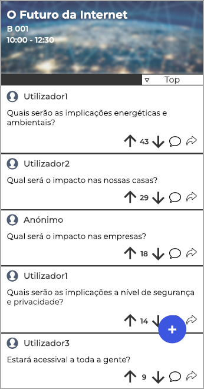

# openCX Development Report

Welcome to the documentation pages of the **openCX- UpQuestion** project!

You can find here detailed information about the project, from a high-level product vision to low-level implementation decisions, organized as a kind of Software Development Report 

* #### Business modeling

    *  [Product Vision](#Product-Vision)

    *  [Elevator Pitch](#Elevator-Pitch)

* #### Requirements

    *  [Use Case Diagram](#Use-case-diagram)

    *  [User stories](#User-stories)

    * [Mockups](#Mockups)

* #### Tasks Management Tool

***

So far, contributions are exclusively made by the initial Goal Diggers team, but we hope to open them to the community, in all areas and topics: requirements, technologies, development, experimentation, testing, etc.

Please contact us!

Thank you!

Team Members:
  - [André Gomes](https://github.com/andremsgomes)
  - [Manuel Coutinho](https://github.com/ManelCoutinho) 
  - [Roberto Mourato](https://github.com/RobertoMourato)
  - [Ruben Almeida](https://github.com/arubenruben) 
  - [Tiago Silva](https://github.com/tiagogsilva) 

***

## Product Vision

To make great questions heard (by the speaker)

## Elevator Pitch

Tired of the long awkward silences when speaker asks "Any questions??"; Tired of hearing the front line old lady telling her life story taking up your question space? Don't worry!! Send us your questions and upvote your favorites. Make your voice heard without the hassle of waiting for a mic.

## Requirements

UpQuestion was designed to end up with the inefficient experience of the participants in a conference at the end moment when questions are made/answered.

The main stakeholders identified in the given context are:

* The Participant- Person who attend to listen the speaker in   a certain talk. Has the capability to Submit questions and   to upvote other participants questions he thinks deserve     being answered.

* The Speaker- Person expert on the subject who performs the   talk. Has limited time to answer an, also, limited number     of questions and intend to invest that time to answer the     most interesting questions.

We believe that a communitarian forum open to all conference participants with features of upvote is our greatest ally to cluster the greatest questions, those that will be answered in that limited period.

A more detailed analysis of this topic is made below targeting RUP & AGILE methodologies of requirement engineering:

### Use case diagram

                                    **PREENCHER**
### User stories

User Stories | MoSCoW | Tshirt_Size | Acceptance Tests|
---|---|---|---|
 As a participant, I want to be able to ask my question. | Must |
 As speaker, i want to be able to see all questions done, so that i could reply them | Must |
 As a participant, I want to be able to vote previously asked questions so that the most interesting questions get answered by the speaker | Should |
 As a speaker, I want to be able to see the most voted questions so that I can answer them first. | Should |
 As a participant, I want to be able to select the conference I'm in so that I can ask questions in the proper site. | Should |
 As a participant, I would like to ask anonymous questions so that I don't reveal my identity.  |Should |
 As a speaker and user, I want to be able to authenticate in order to connect my profile with the activity that I'm attending.|Should|
 As a user, I want to share my questions on Twitter so that my followers know what my interests are.|Should |
 As an organizer, I want to share the most voted questions to promote the conference.|Should |
 As an organizer, I want to use the data in order to make networking easier.| Should| 
 As user i would like to share my question with my Twitter followers|Should|
 
 #### Mockups
 
 The mockups for this project were developed in Figma and can be found [here](https://www.figma.com/file/BlnF2GOIbviAUOwevrIHnR/UpQuestion?node-id=0%3A1).  

 
 *Fig.1: Login Page*

 
 *Fig.2: Schedule*

 
 *Fig.3: Posted Questions*

 
 *Fig.4 New Question Form*

 
                        ***Por Preencher***
 
 
## Tasks Management Tools
To communicate more efficiently we chose to use **Trello**  as our main tool of tasks management. User Stories with their BDD text, User Case Diagram and the work flow can be found [there](https://trello.com/b/08Qa7QyI).

